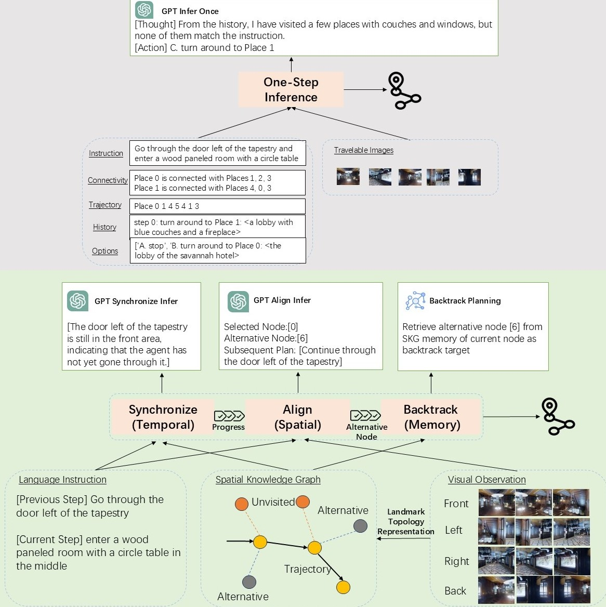

# SpatialGPT
 In this work, we propose SpatialGPT, a novel GPT-based VLN agent that introduces a Synchronize-Align-Backtrack reasoning chain. This approach enhances the agent’s ability to reason about progress, infer navigation directions, and plan active backtracking. Additionally, we introduce a Spatial Knowledge Graph that records observed landmark topology using spatial domain methods, enabling structured retrieval and controlled backtracking by recalling inferred alternative paths. Experimental results demonstrate that SpatialGPT achieves state-of-the-art zero-shot performance on the R2R benchmark.

 Note: In compliance with ACL's Two-Way Anonymized Review requirement, this GitHub repository remains anonymized. All links provided below originate from public repositories of other researchers. Similarly, the standard data preparation and download links are sourced from public data servers maintained by other researchers. None of these links are associated with the identities of our authors.
 
 .

## Installation
1. Matterport3D installation instruction: [here](https://github.com/peteanderson80/Matterport3DSimulator). 
2. Install requirements:
```setup
conda create -n SpatialGPT python=3.10
conda activate SpatialGPT
pip install -r requirements.txt
```

## Data Preparation
1. Follow the same data preparation procedure as [MapGPT](https://github.com/chen-judge/MapGPT?tab=readme-ov-file) to collect val-unseen set and observation images.
2. Move the sampled subset (72 scenarios, 216 trajectories) file of SpatialGPT_72_scenes_processed.json from current directory to the `datasets/R2R/annotations` directory. 

## OpenAI API key
Fill your API key in the file: GPT/api.py Line 12.

## Run SpatialGPT

```bash
bash scripts/gpt4o.sh
```

Note that you should modify the following part in gpt4o.sh to set the path to your observation images, the split you want to test, etc.

```bash
--root_dir ${DATA_ROOT}
--img_root /path/to/images
--split SpatialGPT_72_scenes_processed
--end 10  # the number of cases to be tested
--output_dir ${outdir}
--max_action_len 15
--save_pred
--stop_after 3
--llm gpt-4o
--response_format json
--max_tokens 4096
```

