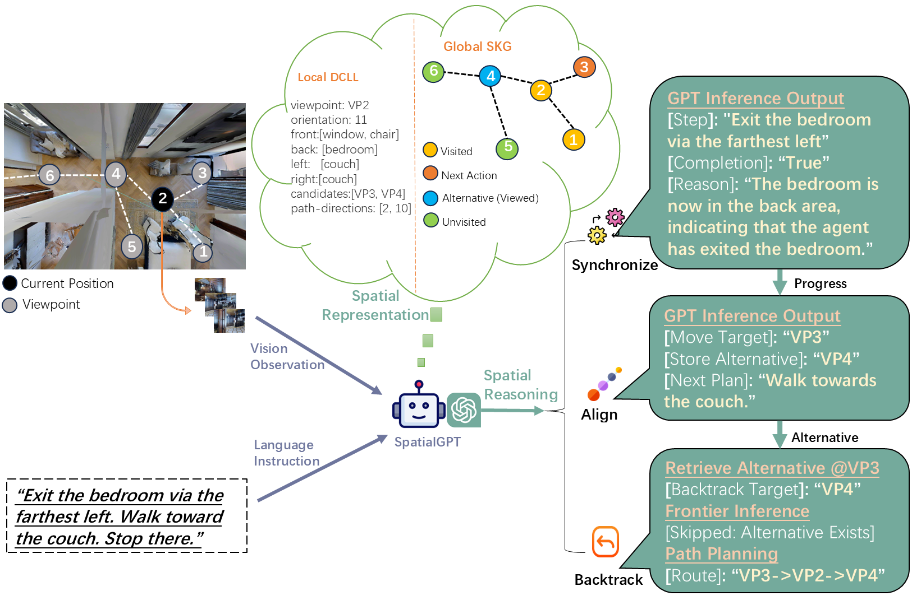

# SpatialGPT
In this work, we propose SpatialGPT, a novel GPT-based **Vision-and-Language Navigation (VLN)**  agent in complex indoor environments. It incorporates spatial domain knowledge and the Chain-of-Thought (CoT) paradigm to enhance LLM-based spatial reasoning. 

## Key Features

- **Synchronize-Align-Backtrack (SAB) Reasoning Chain**: A three-stage chain-of-thought paradigm to handle ambiguous or multi-step VLN instructions.
- **Directional Connected Landmark List (DCLL) Local Memory**: Dynamically model local visual context using spatial domain knowledge as structured local spatial representation.
- **Spatial Knowledge Graph (SKG) Global Memory**: Tracks objects, locations, and explored topology as structurad global spatial representation for memory-augmented reasoning.
- **Zero-Shot Execution**: Built on GPT-4o without requiring task-specific training.

 .
## Clone the Repository
```bash
git clone https://github.com/nobodynovember/SpatialGPT.git
cd SpatialGPT
``` 
## Installation
1. Matterport3D installation instruction: [here](https://github.com/peteanderson80/Matterport3DSimulator). 
2. Install requirements:
```setup
conda create -n SpatialGPT python=3.10
conda activate SpatialGPT
pip install -r requirements.txt
```

## Data Preparation
1. To accelerate simulation, observation images should be pre-collected from the simulator. You can use your own saved images or use the [RGB_Observations.zip](https://connecthkuhk-my.sharepoint.com/:f:/g/personal/jadge_connect_hku_hk/Eq00RV04jXpNkwqowKh5mYABBTqBG1U2RXgQ7FvaGweJOQ?e=rL1d6p)  pre-collected in prior research work.

2. For the validation unseen set in experiment, follow [DUET](https://github.com/cshizhe/VLN-DUET/) to set the [annotations](https://www.dropbox.com/sh/u3lhng7t2gq36td/AABAIdFnJxhhCg2ItpAhMtUBa?dl=0) for testing on the val-unseen split. 

3. For the various-scenes set in experiment, once the above annotationss setting is complete, move the file SpatialGPT_72_scenes_processed.json from current directory to the 'datasets/R2R/annotations/' directory.

## OpenAI API key
Fill in your API key at Line 12 of the file: GPT/api.py.

## Run SpatialGPT
```bash
export PYTHONPATH=$PYTHONPATH:/path/to/your/SpatialGPT
bash scripts/gpt4o.sh
```

Note that you should modify the following part in gpt4o.sh to set the path to your observation images, the split you want to test, etc.

```bash
--root_dir ${DATA_ROOT}
--img_root /path/to/images
--split SpatialGPT_72_scenes_processed
--end 10  # the number of cases to be tested
--output_dir ${outdir}
--max_action_len 15
--save_pred
--stop_after 3
--llm gpt-4o
--response_format json
--max_tokens 4096
```
If you have any questions, please contact me by email: zhiqiang.jiang@ucalgary.ca


